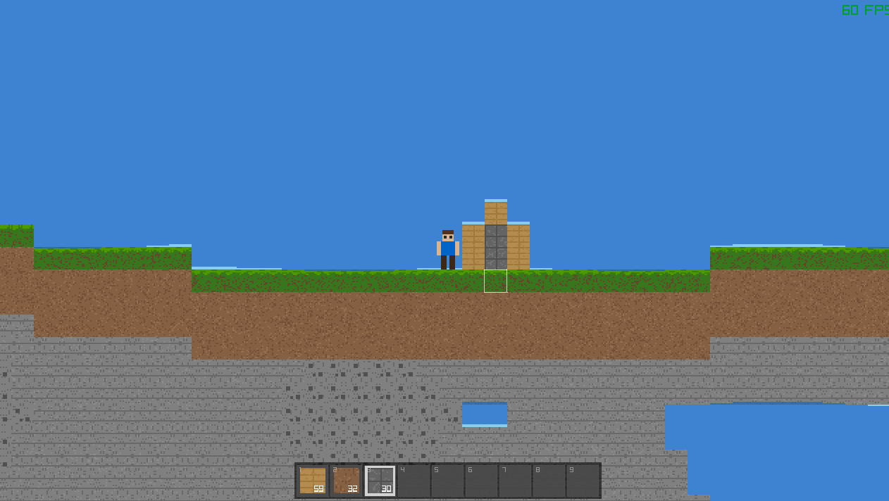

# MyWorld

A 2D sandbox game inspired by Minecraft, built with [raylib](https://www.raylib.com/) 5.5. All assets are procedurally generated pixel art -- no external textures or sprites required.



## Features

- **Procedural World Generation** -- 2048x256 block world with terrain, caves, trees, and ores using fractal Brownian motion noise
- **15 Block Types** -- Grass, dirt, stone, wood, leaves, sand, water, coal ore, iron ore, glass, brick, and more
- **Day/Night Cycle** -- Dynamic sky color and lighting overlay
- **Chunk-Based Rendering** -- Only visible chunks are rendered for performance
- **Block Interaction** -- Break and place blocks within range
- **Inventory System** -- 9-slot hotbar with stacking (up to 64 per slot)

## Controls

| Key | Action |
|-----|--------|
| `A` / `D` or `Left` / `Right` | Move left / right |
| `W` / `Up` / `Space` | Jump |
| `Left Mouse Button` | Break block |
| `Right Mouse Button` | Place block |
| `1` - `9` | Select hotbar slot |
| `F3` | Toggle debug info |

## Building from Source

### Prerequisites

- [raylib 5.5](https://github.com/raysan5/raylib/releases/tag/5.5)
- GCC (MinGW on Windows)
- GNU Make

### Setup

1. Download raylib 5.5 and place the files:
   ```
   include/
     raylib.h
     raymath.h
     rlgl.h
   lib/
     libraylib.a
   ```

2. Build:
   ```bash
   make -f makefile.win
   ```

3. Run `MyWorld.exe`

### Platform Notes

The `makefile.win` is configured for Windows with MinGW. For Linux/macOS, adjust the makefile to remove `-mwindows` and `-lgdi32`, and link against `-lX11` or the appropriate platform libraries.

## License

This project is licensed under the GPL-3.0 License. See [LICENSE](LICENSE) for details.
