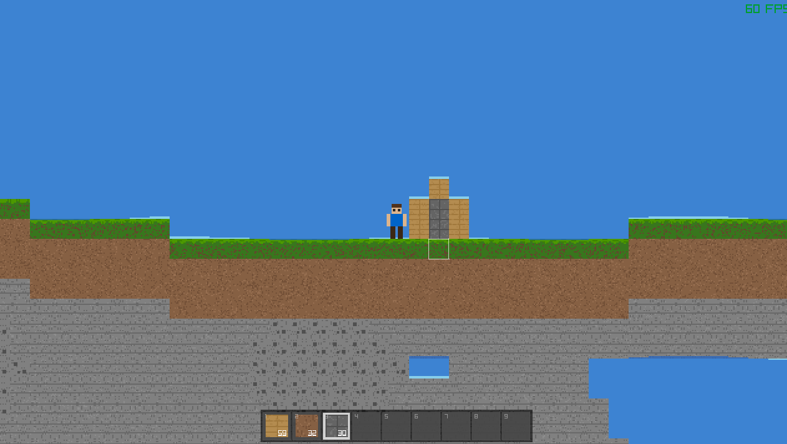

# MyWorld

A 2D sandbox game inspired by Minecraft, built with [raylib](https://www.raylib.com/) 5.5.
All assets are procedurally generated pixel art — no external textures or sprites required.



## Features

- **Procedural World Generation** — 2048×256 block world with terrain, caves, trees, ores,
  villages, dungeons, and multiple biomes using fractal Brownian motion noise.
- **50+ Blocks & Items** — building blocks, ores, tools, armor, food, redstone components,
  crops, and more.
- **Day/Night Cycle** — dynamic sky color, lighting overlay, and mob spawning.
- **Chunk-Based Rendering** — only visible chunks are rendered for performance.
- **Inventory System** — 36-slot inventory, 9-slot hotbar with stacking up to 64, tool
  durability, and enchantments.
- **Crafting & Smelting** — craft recipes and furnace smelting.
- **Redstone** — levers, pressure plates, redstone wire, lamps, and TNT ignition.
- **Multiplayer** — host/join over LAN with up to 4 players.
- **Chat & Commands** — in-game chat (`T`) and slash commands (`/help`, `/tp`, `/give`, etc.).
  See [COMMANDS.md](COMMANDS.md) for details.

## Controls

| Key | Action |
|-----|--------|
| `A` / `D` or `Left` / `Right` | Move left / right |
| `W` / `Up` / `Space` | Jump |
| `Left Shift` | Sprint |
| `Left Mouse Button` | Break block / attack |
| `Right Mouse Button` | Place block / use item |
| `E` | Open inventory / interact |
| `1` – `9` | Select hotbar slot |
| `Mouse Wheel` | Scroll hotbar |
| `F3` | Toggle debug info |
| `F11` | Toggle fullscreen |
| `M` | Toggle large map |
| `T` | Open chat |
| `Esc` | Close menu / chat |

## Building from Source

### Prerequisites

- [raylib 5.5](https://github.com/raysan5/raylib/releases/tag/5.5)
- GCC (MinGW on Windows)
- GNU Make

### Setup

1. Download raylib 5.5 and place the files:
   ```
   include/
     raylib.h
     raymath.h
     rlgl.h
   lib/
     libraylib.a
   ```

2. Build:
   ```bash
   make clean && make
   ```

3. Run `MyWorld.exe`

### Platform Notes

The `Makefile` is configured for Windows with MinGW. For Linux/macOS, adjust the makefile to
remove `-mwindows` and `-lgdi32`, and link against `-lX11` or the appropriate platform
libraries.

## License

This project is licensed under the GPL-3.0 License. See [LICENSE](LICENSE) for details.
